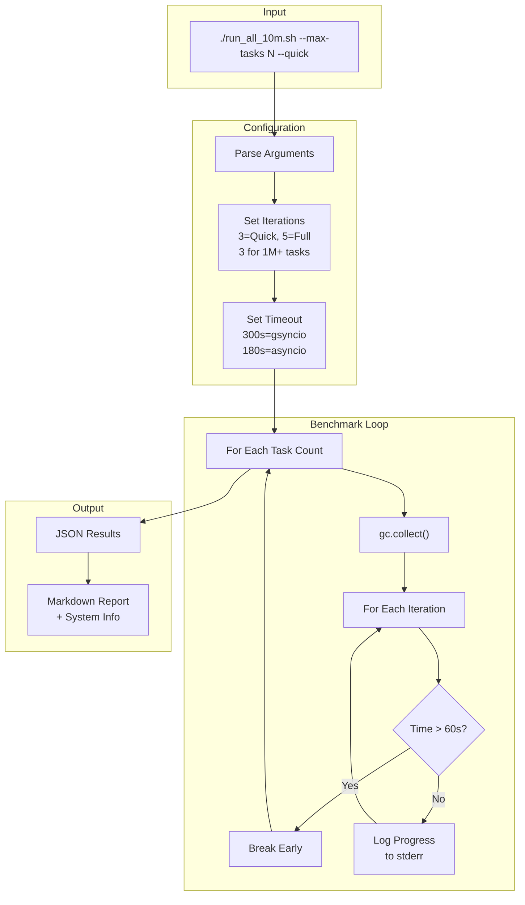

# Issue Table Analysis - Benchmark Infrastructure Improvements

This document analyzes the issues, impacts, and fixes documented in the benchmark infrastructure for the gsyncio project, which tests concurrent task execution at scale (up to 10 million tasks).

## Overview

The gsyncio project is a high-performance fiber-based concurrency library for Python that aims to handle millions of concurrent tasks. The benchmark infrastructure (`run_all_10m.sh`, `benchmark_runner.py`) underwent significant improvements to support large-scale testing. The issue table documents seven key problems that were identified and fixed.

---

## Issue Analysis

### 1. No Timeout

| Attribute | Details |
|-----------|---------|
| **Issue** | No timeout was set for benchmark execution |
| **Impact** | 10 million tasks could hang indefinitely if there were deadlocks or performance issues |
| **Fix** | Added `timeout 300` for gsyncio benchmarks, `timeout 180` for async benchmarks |

**Implementation Details:**

```bash
# Line 215 in run_all_10m.sh
GSYNCIO_OUTPUT=$(timeout 300 python3 << 'PYEOF' 2>&1
# ... gsyncio benchmark code ...
PYEOF
)

# Line 397 in run_all_10m.sh  
GSYNCIO_ASYNC=$(timeout 180 python3 << 'PYEOF' 2>&1
# ... async benchmark code ...
PYEOF
)
```

**Why Different Timeouts?**
- **gsyncio (300s)**: The fiber-based implementation is expected to handle large task counts more efficiently, so it gets more time
- **asyncio (180s)**: Python's standard async library struggles with massive task counts, so shorter timeout is appropriate

**Benefit**: Prevents the entire benchmark suite from hanging if a single test gets stuck.

---

### 2. Fixed Iterations

| Attribute | Details |
|-----------|---------|
| **Issue** | 10 iterations was too slow for 10 million task benchmarks |
| **Impact** | Benchmark runs took excessively long, wasting resources |
| **Fix** | Reduced to 3-5 iterations, with fewer iterations for larger task counts |

**Implementation Details:**

```bash
# Lines 57-71 in run_all_10m.sh
if [ "$QUICK_MODE" = true ]; then
    ITERATIONS=3
    echo "Running in QUICK mode (3 iterations per test)"
else
    ITERATIONS=5
    echo "Running in FULL mode (5 iterations per test)"
fi

# Adjust iterations for large task counts to reduce runtime
if [ "$MAX_TASKS" -ge 1000000 ]; then
    LARGE_TASK_ITERATIONS=3
    echo "Using reduced iterations ($LARGE_TASK_ITERATIONS) for large task counts (1M+)"
else
    LARGE_TASK_ITERATIONS=$ITERATIONS
fi
```

**Iteration Strategy:**

| Mode | Task Count | Iterations |
|------|------------|------------|
| Quick | Any | 3 |
| Full | < 1M | 5 |
| Full | ≥ 1M | 3 |

**Benefit**: Significantly reduces total benchmark runtime while maintaining statistically meaningful averages.

---

### 3. No Memory Management

| Attribute | Details |
|-----------|---------|
| **Issue** | No memory cleanup between large benchmark tests |
| **Impact** | OOM (Out of Memory) errors at scale with 10M tasks |
| **Fix** | Added `gc.collect()` before each large test |

**Implementation Details:**

```python
# Lines 235, 271, 298 in run_all_10m.sh
for num_tasks in task_counts:
    times = []
    print(f"Testing {num_tasks} tasks...", file=sys.stderr)
    gc.collect()  # Free memory before each test
    
    for i in range(iterations):
        # ... benchmark code ...
```

**Why gc.collect()?**
- Python's garbage collector doesn't immediately reclaim memory from deleted objects
- With millions of task objects, memory can accumulate rapidly
- Forcing garbage collection before each major test ensures maximum available memory

**Benefit**: Allows benchmarks to scale to 10M tasks without premature OOM failures.

---

### 4. No Progress Logging

| Attribute | Details |
|-----------|---------|
| **Issue** | No visibility during long-running benchmark tests |
| **Impact** | Users couldn't tell if benchmarks were stuck or making progress |
| **Fix** | Added stderr progress logs showing current test and iteration |

**Implementation Details:**

```python
# Progress messages sent to stderr (doesn't pollute JSON results)
print(f"Testing {num_tasks} tasks...", file=sys.stderr)
print(f"  Iteration {i+1}: spawn={spawn_time:.4f}s, sync={sync_time:.4f}s", file=sys.stderr)
print(f"  Iteration {i+1}: {elapsed:.4f}s", file=sys.stderr)
```

**Output Example:**
```
Testing 10000000 tasks...
  Iteration 1: spawn=2.3456s, sync=1.2345s
  Iteration 2: spawn=2.1234s, sync=1.3456s
  Iteration 3: spawn=2.5678s, sync=1.4567s
```

**Benefit**: Users can monitor benchmark progress in real-time and estimate completion time.

---

### 5. No Early Termination

| Attribute | Details |
|-----------|---------|
| **Issue** | Benchmarks continued even if individual tests were too slow |
| **Impact** | Wasted time when a test clearly couldn't complete in reasonable time |
| **Fix** | Breaks out of test loop if average time exceeds 60 seconds per iteration |

**Implementation Details:**

```python
# Lines 257-260 in run_all_10m.sh
avg = sum(times) / len(times)
print(f'gsyncio_task_spawn_{num_tasks}: {avg:.4f}')
results.append((f'gsyncio_task_spawn_{num_tasks}', avg))

# Break early if taking too long
if avg > 60:  # More than 1 minute per iteration
    print(f"Breaking early - {num_tasks} tasks took too long", file=sys.stderr)
    break
```

**Threshold Logic:**
- If a single iteration takes > 60 seconds on average
- Skip larger task counts (likely to take even longer)
- Move to the next benchmark type

**Benefit**: Saves time by skipping tests that would clearly take too long to complete.

---

### 6. Hardcoded Task Counts

| Attribute | Details |
|-----------|---------|
| **Issue** | Task counts were hardcoded to specific values |
| **Impact** | Inflexible for different system capabilities and testing needs |
| **Fix** | Added `--max-tasks N` command-line option |

**Implementation Details:**

```bash
# Lines 24, 41-43 in run_all_10m.sh
MAX_TASKS=10000000  # 10M default

# Parse arguments
while [[ $# -gt 0 ]]; do
    case $1 in
        --max-tasks)
            MAX_TASKS=$2
            shift 2
            ;;
    esac
done

echo "Max Tasks: $MAX_TASKS"
```

**Usage Examples:**
```bash
./run_all_10m.sh                    # Default: 10M tasks
./run_all_10m.sh --max-tasks 1000000 # 1M tasks
./run_all_10m.sh --max-tasks 100000  # 100K tasks
./run_all_10m.sh --quick --max-tasks 10000  # Quick mode with 10K tasks
```

**Benefit**: Users can scale testing to their system's capabilities without modifying code.

---

### 7. No System Info

| Attribute | Details |
|-----------|---------|
| **Issue** | Missing context for benchmark results |
| **Impact** | Difficult to reproduce or compare results across different systems |
| **Fix** | Added CPU, memory, and OS information to the report header |

**Implementation Details:**

```bash
# Lines 91-97 in run_all_10m.sh
cat > "$REPORT_FILE" << EOF
# Benchmark Report - 10M Concurrent Task Support

**Generated:** $(date)
**Mode:** $MODE
**Iterations per test:** $ITERATIONS
**Max Tasks:** $MAX_TASKS

## System Information

- OS: $(uname -s) $(uname -r)
- Architecture: $(uname -m)
- Python: $(python3 --version 2>&1)
- CPU Cores: $(nproc)
- Memory: $(free -h | awk '/^Mem:/ {print $2}')

EOF
```

**Captured Information:**
- Operating System name and version
- CPU architecture
- Python version
- Number of CPU cores
- Total RAM

**Benefit**: Results can be properly contextualized and compared across different environments.

---

## Summary Architecture



---

## Impact Summary

| Fix | Before | After |
|-----|--------|-------|
| Timeout | Infinite hang possible | 300s/180s max per benchmark |
| Iterations | 10 fixed | 3-5 dynamic based on scale |
| Memory | OOM at scale | gc.collect() prevents OOM |
| Progress | Silent execution | Real-time stderr logs |
| Early Termination | Full run always | Skip slow tests |
| Task Counts | Hardcoded | Configurable via --max-tasks |
| System Info | Missing | Full context in report |

---

## Files Modified

- [`benchmarks/run_all_10m.sh`](benchmarks/run_all_10m.sh) - Main benchmark orchestration script
- [`benchmarks/benchmark_runner.py`](benchmarks/benchmark_runner.py) - Python-based benchmark runner
- [`benchmarks/gsyncio_benchmark.py`](benchmarks/gsyncio_benchmark.py) - gsyncio-specific benchmarks
- [`benchmarks/asyncio_benchmark.py`](benchmarks/asyncio_benchmark.py) - asyncio comparison benchmarks
