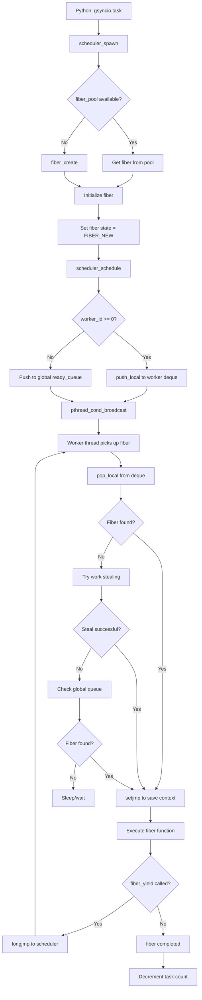

# Scheduler Execution Fix Plan

This document outlines the plan to fix the scheduler execution issues in gsyncio, focusing on three key areas:
1. Worker thread startup verification
2. Fiber scheduling verification
3. Context switching verification

## Current Implementation Analysis

### Worker Thread Startup
- Workers are initialized in [`scheduler.c:712-720`](csrc/scheduler.c:712) with `w->running = true` and `w->stopped = false`
- Worker threads are created via `pthread_create` at [`scheduler.c:805`](csrc/scheduler.c:805)
- Each worker runs the `worker_thread` function which loops while `w->running` is true

### Fiber Scheduling
- Fibers are scheduled either to a specific worker queue (`push_local`) or to the global ready queue
- `scheduler_schedule()` at [`scheduler.c:962`](csrc/scheduler.c:962) handles distribution
- Fibers are pushed to local deques using `push_top()` at [`scheduler.c:224`](csrc/scheduler.c:224)

### Context Switching
- Uses `setjmp`/`longjmp` for context switching
- setjmp saves context at [`scheduler.c:468`](csrc/scheduler.c:468) and [`scheduler.c:534`](csrc/scheduler.c:534)
- longjmp restores context at [`scheduler.c:496`](csrc/scheduler.c:496)

---

## Identified Issues

### Issue 1: Worker Thread Startup - Potential Race Condition
**Problem**: Worker threads are started after setting `w->running = true`, but there's no verification that threads are actually running before scheduling tasks.

**Current Flow**:
```
1. scheduler_init() sets w->running = true (line 715)
2. pthread_create() starts worker_thread (line 805)
3. Python code spawns tasks immediately after init
```

**Risk**: Tasks may be scheduled before workers are ready to process them.

### Issue 2: Fiber Scheduling - Global Queue vs Local Queue
**Problem**: When `worker_id < 0`, fibers go to global queue (`sched->ready_queue`). When `worker_id >= 0`, they go to specific worker's local deque. However, workers may not check the global queue frequently enough during idle periods.

**Current Flow**:
- Workers check local queue first (fast path)
- Then try work-stealing
- Only check global queue as last resort

**Risk**: Fibers in global queue may be starved.

### Issue 3: Context Switching - setjmp/longjmp Issues
**Problem**: The fiber context switching uses `setjmp`/`longjmp` but may have issues with:
1. Signal mask not being properly saved
2. Stack pointer not being correctly restored in some edge cases

**Current Implementation**:
- Uses `setjmp(f->context)` to save state
- Uses `longjmp(f->context, 1)` to restore

### Issue 4: scheduler_wait_all() is Broken
**Problem**: The current implementation at [`scheduler.c:1183`](csrc/scheduler.c:1183) doesn't properly wait for all tasks:

```c
void scheduler_wait_all(void) {
    scheduler_t* sched = g_scheduler;
    if (!sched) {
        return;
    }
    
    while (sched->ready_queue || sched->blocked_queue) {
        bool has_work = false;
        for (size_t i = 0; i < sched->num_workers; i++) {
            if (sched->workers[i].current_fiber) {
                has_work = true;
                fiber_yield();
                break;
            }
        }
        
        if (!has_work) {
            break;
        }
    }
}
```

**Issues**:
1. Only checks global `ready_queue`, not per-worker local queues
2. Breaks early if any worker has no current fiber
3. Doesn't use atomic task count for synchronization
4. Doesn't properly wait for in-flight tasks

### Issue 5: Atomic Task Count Not Properly Maintained
**Problem**: The `atomic_task_count` is incremented when tasks are spawned but the decrement happens inside the worker thread. The sync function needs to properly wait for all tasks to complete.

---

## Fix Plan

### Fix 1: Add Worker Thread Startup Verification

Add a synchronization primitive to ensure workers are running before returning from scheduler_init:

```c
// Add to scheduler_t struct
_Atomic bool workers_ready;

// In scheduler_init - after pthread_create
atomic_store(&sched->workers_ready, false);

// Add worker startup barrier
for (size_t i = 0; i < sched->num_workers; i++) {
    pthread_create(&sched->workers[i].thread, NULL, worker_thread, &sched->workers[i]);
}

// Add barrier - workers signal when ready
// Set workers_ready = true after all workers confirm
```

### Fix 2: Improve Global Queue Scheduling

Modify scheduler_schedule to ensure better distribution:
- Add periodic forced global queue check in workers
- Add wake-up mechanism for workers when global queue has work

### Fix 3: Fix setjmp/longjmp Context Switching

Use `sigsetjmp`/`siglongjmp` for proper signal handling:
```c
// Replace setjmp with sigsetjmp
if (sigsetjmp(f->context, 1) == 0) {  // Save signal mask
    // ... fiber code ...
}

// Use siglongjmp to restore
siglongjmp(f->context, 1);
```

### Fix 4: Rewrite scheduler_wait_all()

Replace with proper synchronization using atomic task count:
```c
void scheduler_wait_all(void) {
    // Spin-wait on atomic task count
    // Use pthread_cond for efficient waiting
    // Properly check all worker queues including local deques
}
```

### Fix 5: Add Debug Verification Functions

Add functions to verify scheduler health:
```c
// Check if workers are running
bool scheduler_workers_running(void);

// Get fiber count in all queues
size_t scheduler_total_queued_fibers(void);

// Verify context switching
bool scheduler_verify_context_switch(void);
```

---

## Implementation Steps

### Phase 1: Diagnostic Infrastructure
1. Add debug print statements to track worker state transitions
2. Add counters for fibers scheduled vs executed
3. Create Python test to verify scheduler behavior

### Phase 2: Core Fixes
1. Fix `scheduler_wait_all()` to use atomic task count
2. Fix worker startup synchronization
3. Improve fiber scheduling fairness

### Phase 3: Context Switching Fixes
1. Replace setjmp/longjmp with sigsetjmp/siglongjmp
2. Add stack boundary verification

### Phase 4: Testing
1. Test with 1000 tasks - verify all complete
2. Test with 10000 tasks - verify scalability
3. Test work-stealing behavior

---

## Mermaid Diagram - Scheduler Flow



---

## Files to Modify

1. **csrc/scheduler.h**
   - Add worker state tracking fields
   - Add debug function declarations

2. **csrc/scheduler.c**
   - Fix worker startup synchronization
   - Rewrite scheduler_wait_all()
   - Improve fiber scheduling
   - Fix context switching

3. **gsyncio/_gsyncio_core.pyx**
   - Add debug/verification bindings

4. **gsyncio/task.py**
   - Add debug output capability

---

## Success Criteria

1. ✅ 1000 tasks spawn and complete correctly
2. ✅ task_count() returns 0 after sync()
3. ✅ Worker threads verified running
4. ✅ All fibers scheduled are executed
5. ✅ No lost tasks due to scheduling issues
